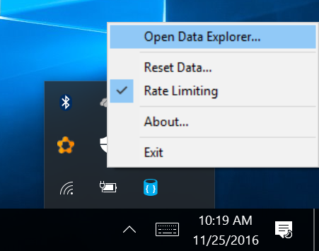

# 使用 Azure DocumentDB 模拟器进行开发和测试

[**下载模拟器**](https://aka.ms/documentdb-emulator)

Azure DocumentDB 模拟器提供了一个模拟用于开发的 Azure DocumentDB 服务的本地环境。使用 DocumentDB 模拟器，可以在本地开发并测试应用程序，而无需创建 Azure 订阅且不会产生任何费用。如果对应用程序在 DocumentDB 模拟器中的工作情况感到满意，则可以切换到在云中使用 Azure DocumentDB 帐户。

## DocumentDB 模拟器系统要求
DocumentDB 模拟器具有以下硬件和软件要求：

- 软件要求
  - Windows Server 2012 R2、Windows Server 2016 或 Windows 10
* 最低硬件要求
  * 2 GB RAM
  * 10 GB 可用硬盘空间

## 安装 DocumentDB 模拟器
可以在 [Microsoft 下载中心](https://aka.ms/documentdb-emulator)下载并安装 DocumentDB 模拟器。

> [!NOTE]
若要安装、配置并运行 DocumentDB 模拟器，必须在计算机上具有管理权限。

## 检查 DocumentDB 模拟器更新
DocumentDB 模拟器包括内置的 Azure DocumentDB 数据资源管理器，用于浏览 DocumentDB 中存储的数据、创建新集合，并且通知何时有新的更新可下载。

> [!NOTE]
在 DocumentDB 模拟器的一个版本中创建的数据不保证在使用不同版本时可以访问。如果需要长期保存数据，建议将数据存储在 Azure DocumentDB 帐户中，而不是存储在 DocumentDB 模拟器中。

## DocumentDB 模拟器的工作方式
DocumentDB 模拟器提供对 DocumentDB 服务的高保真模拟。它支持和 Azure DocumentDB 相同的功能，包括支持创建和查询 JSON 文档、预配集合和调整集合的规模，以及执行存储过程和触发器。可以使用 DocumentDB 模拟器开发和测试应用程序，并且只需对 DocumentDB 的连接终结点进行单个配置的更改就可以将它们部署到全球范围内的 Azure。

虽然创建了实际 DocumentDB 服务的高保真本地模拟，但是 DocumentDB 模拟器的实现不同于该服务。例如，DocumentDB 模拟器针对持久性使用标准 OS 组件（如本地文件系统），针对连接性使用 HTTPS 协议堆栈。这意味着一些依赖于 Azure 基础结构的功能，如全局复制、读/写的一位数毫秒延迟和可调一致性级别，无法通过 DocumentDB 模拟器使用。

## 对 DocumentDB 模拟器的请求进行身份验证
和云中的 Azure Document 一样，每个针对 DocumentDB 模拟器的请求都必须进行身份验证。DocumentDB 模拟器使用一个固定的帐户和公开的身份验证密钥进行主密钥身份验证。此帐户和密钥是允许用于 DocumentDB 模拟器的唯一凭据。它们具有以下特点：

    Account name: localhost:<port>
    Account key: C2y6yDjf5/R+ob0N8A7Cgv30VRDJIWEHLM+4QDU5DE2nQ9nDuVTqobD4b8mGGyPMbIZnqyMsEcaGQy67XIw/Jw==

> [!NOTE]
DocumentDB 模拟器支持的主密钥仅用于模拟器。不能在 DocumentDB 模拟器中使用生产 DocumentDB 帐户和密钥。

此外，和 Azure DocumentDB 服务一样，DocumentDB 模拟器仅支持使用 SSL 的安全通信。

## 启动并初始化 DocumentDB 模拟器

若要启动 Azure DocumentDB 模拟器，请选择“开始”按钮或按 Windows 键。先键入“DocumentDB 模拟器”，然后从应用程序列表中选择该模拟器。

  

运行模拟器时，在 Windows 任务栏通知区域中会显示一个图标。默认情况下，DocumentDB 模拟器在端口 8081 上侦听的本地计算机（“localhost”）上运行。

  

默认情况下，DocumentDB 模拟器安装到 `C:\Program Files\Azure DocumentDB Emulator` 目录。你还可以从命令行启动和停止模拟器。有关详细信息，请参阅[命令行工具参考](#command-line)。

## 启动本地模拟器数据资源管理器

本地模拟器启动时，会自动在浏览器中打开 DocumentDB 数据资源管理器。地址会显示为 https://localhost:8081/_explorer/index.html。如果关闭浏览器并想要稍后重新打开，可在浏览器中打开 URL 或从 Windows 任务栏图标中的 DocumentDB 模拟器中启动，如下所示。

  

## 使用 DocumentDB 模拟器进行开发
在桌面上运行 DocumentDB 模拟器之后，可以使用任何支持的 [DocumentDB SDK](./documentdb-sdk-dotnet.md) 或 [DocumentDB REST API](https://msdn.microsoft.com/zh-cn/library/azure/dn781481.aspx) 与模拟器进行交互。DocumentDB 模拟器还包括内置的数据资源管理器，可用于创建集合、查看和编辑文档，而无需编写任何代码。

    // Connect to the DocumentDB Emulator running locally
    DocumentClient client = new DocumentClient(
        new Uri("https://localhost:8081"), 
        "C2y6yDjf5/R+ob0N8A7Cgv30VRDJIWEHLM+4QDU5DE2nQ9nDuVTqobD4b8mGGyPMbIZnqyMsEcaGQy67XIw/Jw==",
        new ConnectionPolicy { EnableEndpointDiscovery = false });

> [!NOTE]
连接到模拟器时，必须在连接配置中设置 EnableEndpointDiscovery = false。

如果使用[具有 MongoDB 协议支持的 DocumentDB](./documentdb-protocol-mongodb.md)，请使用以下连接字符串：

    mongodb://localhost:C2y6yDjf5/R+ob0N8A7Cgv30VRDJIWEHLM+4QDU5DE2nQ9nDuVTqobD4b8mGGyPMbIZnqyMsEcaGQy67XIw/Jw==@localhost:10250/admin?ssl=true&3t.sslSelfSignedCerts=true

可以使用现有工具如 [DocumentDB Studio](https://github.com/mingaliu/DocumentDBStudio) 连接到 DocumentDB 模拟器。用户还可以使用 [DocumentDB 数据迁移工具](https://github.com/azure/azure-documentdb-datamigrationtool)在 DocumentDB 模拟器和 Azure DocumentDB 服务之间迁移数据。

## 导出 DocumentDB 模拟器 SSL 证书

.NET 语言和运行时使用 Windows 证书存储来安全地连接到 DocumentDB 本地模拟器。其他语言拥有自己的证书管理和使用方法。Java 使用自己的[证书存储](https://docs.oracle.com/cd/E19830-01/819-4712/ablqw/index.html)，而 Python 则使用[套接字包装器](https://docs.python.org/2/library/ssl.html)。

若要获取与不集成到 Windows 证书存储中的语言和运行时配合使用的证书，需要使用 Windows 证书管理器进行导出。可通过运行 certlm.msc 进行启动，也可按照[导出 DocumentDB 模拟器证书](./documentdb-nosql-local-emulator-export-ssl-certificates.md)中的分步说明进行操作。证书管理器开始运行后，如下所示打开个人证书，然后将友好名称为“DocumentDBEmulatorCertificate”的证书作为 BASE-64 编码的 X.509 \(.cer\) 文件导出。

  

可按照[将证书添加到 Java CA 证书存储](../java-add-certificate-ca-store.md)中的说明，将 X.509 证书导入 Java 证书存储。证书导入 cacerts 存储后，Java 和 MongoDB 应用程序即能够连接到 DocumentDB 模拟器。

## DocumentDB 模拟器命令行工具参考
从安装位置中，可以使用命令行启动和停止模拟器、配置选项，和执行其他操作。

### 命令行语法

    DocumentDB.Emulator.exe [/shutdown] [/datapath] [/port] [/mongoport] [/directports] [/key] [/?]

若要查看选项列表，请在命令提示符下键入 `DocumentDB.Emulator.exe /?`。

<table>
<tr>
  <td><strong>选项</strong></td>
  <td><strong>说明</strong></td>
  <td><strong>命令</strong></td>
  <td><strong>参数</strong></td>
</tr>
<tr>
  <td>[无参数]</td>
  <td>使用默认设置启动 DocumentDB 模拟器</td>
  <td>DocumentDB.Emulator.exe</td>
  <td></td>
</tr>
<tr>
  <td>Shutdown</td>
  <td>关闭 DocumentDB 模拟器</td>
  <td>DocumentDB.Emulator.exe /Shutdown</td>
  <td></td>
</tr>
<tr>
  <td>帮助</td>
  <td>显示命令行参数列表</td>
  <td>DocumentDB.Emulator.exe /?</td>
  <td></td>
</tr>
<tr>
  <td>Datapath</td>
  <td>指定要在其中存储数据文件的路径</td>
  <td>DocumentDB.Emulator.exe /datapath=&lt;datapath></td>
  <td>&lt;datapath>：可访问的路径</td>
</tr>
<tr>
  <td>端口</td>
  <td>指定用于模拟器的端口号。默认值为 8081</td>
  <td>DocumentDB.Emulator.exe /port=&lt;port></td>
  <td>&lt;port>：单个端口号</td>
</tr>
<tr>
  <td>MongoPort</td>
  <td>指定用于 MongoDB 兼容性 API 的端口号。默认值为 10250。</td>
  <td>DocumentDB.Emulator.exe /mongoport=&lt;mongoport></td>
  <td>&lt;mongoport>：单个端口号</td>
</tr>
<tr>
  <td>DirectPorts</td>
  <td>指定用于直接连接的端口。默认值为 10251、10252、10253、10254</td>
  <td>DocumentDB.Emulator.exe /directports:&lt;directports></td>
  <td>&lt;directports>：4 个端口的逗号分隔列表</td>
</tr>
<tr>
  <td>键</td>
  <td>模拟器的授权密钥。密钥必须是 64 字节向量的 base 64 编码</td>
  <td>DocumentDB.Emulator.exe /key:&lt;key></td>
  <td>&lt;key>：密钥必须是 64 字节向量的 base 64 编码</td>
</tr>
<tr>
  <td>EnableThrottling</td>
  <td>指定启用了请求限制行为</td>
  <td>DocumentDB.Emulator.exe /enablethrottling</td>
  <td></td>
</tr>
<tr>
  <td>DisableThrottling</td>
  <td>指定禁用了请求限制行为</td>
  <td>DocumentDB.Emulator.exe /disablethrottling</td>
  <td></td>
</tr>
<tr>
  <td>NoUi</td>
  <td>不显示模拟器用户界面。</td>
  <td>DocumentDB.LocalEmulator.exe /noui</td>
  <td></td>
</tr>
<tr>
  <td>NoExplorer</td>
  <td>不在启动时显示文档资源管理器。</td>
  <td>DocumentDB.LocalEmulator.exe /noexplorer</td>
  <td></td>
</tr>
</table>

## DocumentDB 模拟器与 Azure DocumentDB 之间的差异 
由于 DocumentDB 模拟器提供在本地开发人员工作站上运行的模拟环境，因此模拟器与云中的 Azure DocumentDB 帐户之间的功能存在一些差异：

- DocumentDB 模拟器只支持一个固定的帐户和公开的主密钥。在 DocumentDB 模拟器中无法重新生成密钥。
- DocumentDB 模拟器不是可扩展的服务，并且不支持大量集合。
- DocumentDB 模拟器不模拟不同的 [DocumentDB 一致性级别](./documentdb-consistency-levels.md)。
- DocumentDB 模拟器不模拟[多区域复制](./documentdb-distribute-data-globally.md)。
- DocumentDB 模拟器不支持服务配额覆盖，而 Azure DocumentDB 服务支持（例如文档大小限制、增加的分区集合存储）。
- 由于 DocumentDB 模拟器的副本不一定能反应 Azure DocumentDB 的最新更改，因此请使用 [DocumentDB 容量规划器](https://www.documentdb.com/capacityplanner)准确估计应用程序的生产吞吐量需求。

## 后续步骤
- 若要了解有关 DocumentDB 的详细信息，请参阅 [Azure DocumentDB 简介](./documentdb-introduction.md)。
- 若要开始使用 DocumentDB 模拟器进行开发，请下载一个[支持的 DocumentDB SDK](./documentdb-sdk-dotnet.md)。

<!---HONumber=Mooncake_0109_2017-->
