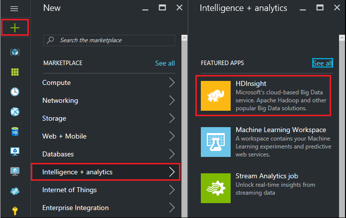
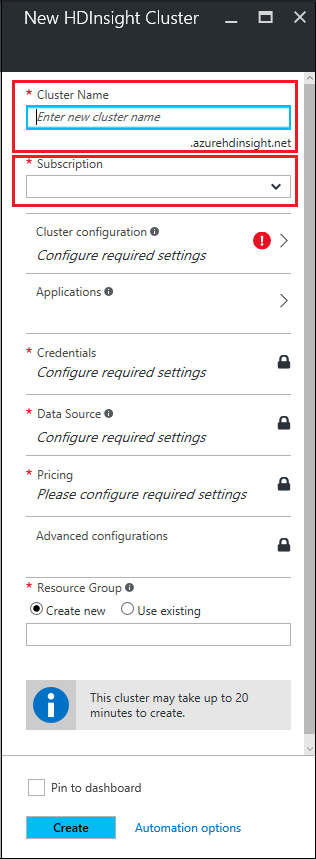
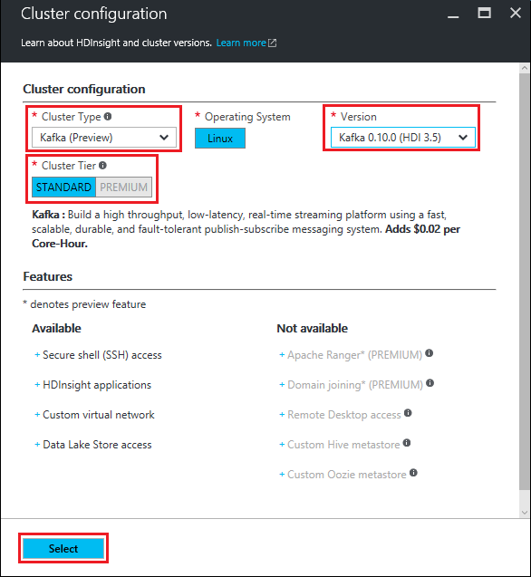
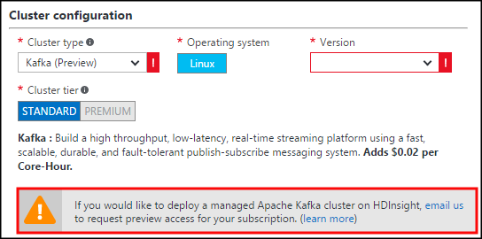
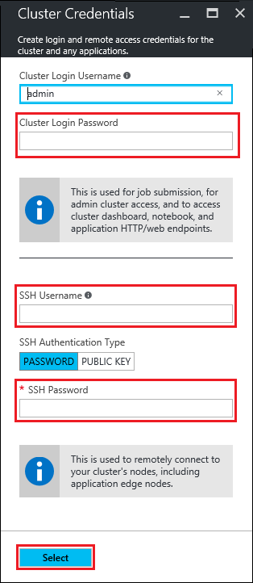
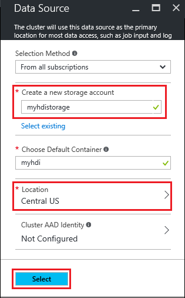
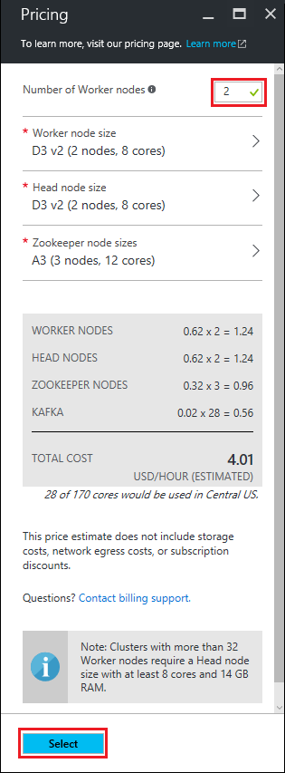
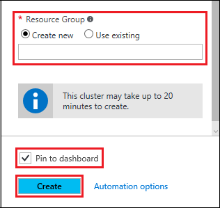

<!-- not suitable for Mooncake -->

<properties
    pageTitle="Apache Kafka on HDInsight 入门 | Azure"
    description="了解有关在 HDInsight 上创建和使用 Kafka 的基础知识。"
    services="hdinsight"
    documentationcenter=""
    author="Blackmist"
    manager="jhubbard"
    editor="cgronlun" />
<tags 
    ms.assetid="43585abf-bec1-4322-adde-6db21de98d7f"
    ms.service="hdinsight"
    ms.devlang=""
    ms.topic="article"
    ms.tgt_pltfrm="na"
    ms.workload="big-data"
    ms.date="01/09/2017"
    wacn.date="01/25/2017"
    ms.author="larryfr" />

# Apache Kafka on HDInsight（预览版）入门

[Apache Kafka](https://kafka.apache.org) 是 HDInsight 随附的开源分布式流平台。它提供类似于发布-订阅消息队列的功能，因此通常用作消息中转站。本文档介绍如何创建 Kafka on HDInsight 群集，然后与 Java 应用程序相互发送和接收数据。

> [AZURE.NOTE]
目前，HDInsight 提供两个 Kafka 版本：0.9.0 (HDInsight 3.4) 和 0.10.0 (HDInsight 3.5)。本文档中的步骤假设使用 HDInsight 3.5 上的 Kafka。

## 先决条件

[AZURE.INCLUDE [delete-cluster-warning](../../includes/hdinsight-delete-cluster-warning.md)]

你必须具备以下条件才能成功完成本 Apache Storm 教程：

* **一个 Azure 订阅**。请参阅[获取 Azure 试用版](/pricing/1rmb-trial/)。

* **熟悉 SSH 和 SCP**。有关如何在 HDInsight 中使用 SSH 和 SCP 的详细信息，请参阅以下文档：
  
    * **Linux、Unix 或 OS X 客户端**：请参阅[在 Linux、OS X 或 Unix 中的 HDInsight 上将 SSH 与基于 Linux 的 Hadoop 配合使用](/documentation/articles/hdinsight-hadoop-linux-use-ssh-unix/)
   
    * **Windows 客户端**：请参阅[在 Windows 中的 HDInsight 上将 SSH 与基于 Linux 的 Hadoop 配合使用](/documentation/articles/hdinsight-hadoop-linux-use-ssh-windows/)

* [Java JDK 8](http://www.oracle.com/technetwork/java/javase/downloads/index.html) 或等效版本，如 OpenJDK。

* [Apache Maven](http://maven.apache.org/)

### 访问控制要求

[AZURE.INCLUDE [access-control](../../includes/hdinsight-access-control-requirements.md)]

## 创建 Kafka 群集

使用以下步骤可以创建 Kafka on HDInsight 群集：

1. 在 [Azure 门户预览](https://portal.azure.cn)中，依次选择“+ 新建”，、“智能 + 分析”、“HDInsight”。
   
      


2. 在“新建 HDInsight 群集”边栏选项卡中，输入**群集名称**并选择要用于此群集的**订阅**。
   
      


3. 使用“选择群集类型”，然后在“群集类型配置”边栏选项卡中选择以下值：
   
    * **群集类型**：Kafka

    * **版本**：Kafka 0.10.0 (HDI 3.5)

    * **群集层**：标准
     
    最后，使用“选择”按钮保存设置。
     
      


    > [AZURE.NOTE]
    如果 Azure 订阅无权访问 Kafka 预览版，将显示有关如何获取预览版的访问权限的说明。将显示类似于下图的说明：
    >
    >   


4. 使用“凭据”配置群集登录名和 SSH 用户凭据。使用“选择”按钮保存设置。
   
    > [AZURE.NOTE]
    使用 HTTPS 通过 Internet 访问群集时，将会用到该群集登录名。SSH 用户用于连接群集以及以交互方式运行命令。
   
      

   
    有关如何将 SSH 与 HDInsight 配合使用的详细信息，请参阅以下文档：
   
    * [Use SSH with HDInsight from a Linux, Unix, or MacOS client（在 Linux、Unix 或 MacOS 客户端中将 SSH 与 HDInsight 配合使用）](/documentation/articles/hdinsight-hadoop-linux-use-ssh-unix/)
   
    * [Use SSH with HDInsight from Windows clients（在 Windows 客户端中将 SSH 与 HDInsight 配合使用）](/documentation/articles/hdinsight-hadoop-linux-use-ssh-windows/)

5. 使用“数据源”配置群集的主数据存储。在“数据源”边栏选项卡中，使用以下信息创建群集的数据存储：
   
    * 选择“新建”，然后输入存储帐户的名称。
    
    * 选择“位置”，然后选择在地理上靠近你的位置。此位置用于创建存储帐户和 HDInsight 群集。
     
    最后，使用“选择”按钮保存设置。
     
      


6. 使用“定价”，然后将“辅助角色节点数”设置为 2。使用 2 个辅助角色节点可帮助降低群集成本，在本示例中已足够。使用“选择”按钮保存设置。
   
      

   
    > [AZURE.NOTE]
    门户中显示的价格可能与屏幕截图中的价格不同。

7. 使用“资源组”创建一个组，然后在字段中输入名称。另外，请选择“固定到仪表板”。完成后，选择“创建”以创建群集。
   
      

   
    > [AZURE.NOTE]
    创建群集可能需要 20 分钟。

## 连接至群集

在客户端中，使用 SSH 连接到群集。如果使用的是 Linux、Unix、MacOS 或 Bash on Windows 10，请使用以下命令：

    ssh SSHUSER@CLUSTERNAME-ssh.azurehdinsight.cn

将 **SSHUSER** 替换为创建群集期间提供的 SSH 用户名。将 **CLUSTERNAME** 替换为群集的名称。

出现提示时，请输入 SSH 帐户使用的密码。

有关如何将 SSH 与 HDInsight 配合使用的信息，请参阅以下文档：

* [在 Linux、Unix 或 OS X 中的 HDInsight 上将 SSH 与基于 Linux 的 Hadoop 配合使用](/documentation/articles/hdinsight-hadoop-linux-use-ssh-unix/)

* [在 Windows 中的 HDInsight 上将 SSH 与基于 Linux 的 Hadoop 配合使用](/documentation/articles/hdinsight-hadoop-linux-use-ssh-windows/)

##<a id="getkafkainfo"></a>获取 Zookeeper 和中转站主机信息

使用 Kafka 时，必须知道 *Zookeeper* 主机和*中转站*主机的值。Kafka API 以及 Kafka 随附的许多实用工具都使用这些主机。

使用以下步骤创建包含主机信息的环境变量。本文档中的步骤将使用这些环境变量。

1. 与群集建立 SSH 连接后，使用以下命令安装 `jq` 实用工具。此实用工具用于分析 JSON 文档，在检索中转站主机信息时非常有用：
   
        sudo apt -y install jq

2. 使用以下命令设置环境变量，其中包含从 Ambari 检索到的信息。将 __KAFKANAME__ 替换为 Kafka 群集的名称。将 __PASSWORD__ 替换为创建群集时使用的登录名 (admin) 密码。

        export KAFKAZKHOSTS=`curl --silent -u admin:PASSWORD -G http://headnodehost:8080/api/v1/clusters/KAFKANAME/services/ZOOKEEPER/components/ZOOKEEPER_SERVER | jq -r '["(.host_components[].HostRoles.host_name):2181"] | join(",")'`

        export KAFKABROKERS=`curl --silent -u admin:PASSWORD -G http://headnodehost:8080/api/v1/clusters/KAFKANAME/services/HDFS/components/DATANODE | jq -r '["(.host_components[].HostRoles.host_name):9092"] | join(",")'`

        echo '$KAFKAZKHOSTS='$KAFKAZKHOSTS
        echo '$KAFKABROKERS='$KAFKABROKERS

    以下文本是 `$KAFKAZKHOSTS` 的内容示例：
   
        zk0-kafka.eahjefxxp1netdbyklgqj5y1ud.ex.internal.chinacloudapp.cn:2181,zk2-kafka.eahjefxxp1netdbyklgqj5y1ud.ex.internal.chinacloudapp.cn:2181,zk3-kafka.eahjefxxp1netdbyklgqj5y1ud.ex.internal.chinacloudapp.cn:2181
   
    以下文本是 `$KAFKABROKERS` 的内容示例：
   
        wn1-kafka.eahjefxxp1netdbyklgqj5y1ud.cx.internal.chinacloudapp.cn:9092,wn0-kafka.eahjefxxp1netdbyklgqj5y1ud.cx.internal.chinacloudapp.cn:9092
   
    > [AZURE.WARNING]
    请不要认为从此会话返回的信息总是准确的。如果缩放群集，会相应地新增或删除中转站。如果发生故障或更换了节点，节点的主机名可能会更改。
    > 
    > 始终应在检索 Zookeeper 和中转站主机信息后尽快使用这些信息，确保信息有效。

## 创建主题

Kafka 将数据流存储在名为*主题*的类别中。在与群集头节点建立 SSH 连接后，使用 Kafka 随附的脚本创建主题：

    /usr/hdp/current/kafka-broker/bin/kafka-topics.sh --create --replication-factor 2 --partitions 8 --topic test --zookeeper $KAFKAZKHOSTS

此命令使用 `$KAFKAZKHOSTS` 中存储的主机信息连接到 Zookeeper，然后创建名为 **test** 的 Kafka 主题。可以通过使用以下脚本列出主题，来验证是否已创建该 test 主题：

    /usr/hdp/current/kafka-broker/bin/kafka-topics.sh --list --zookeeper $KAFKAZKHOSTS

此命令的输出将列出 Kafka 主题，其中包含 **test** 主题。

## 生成和使用记录

Kafka 将*记录*存储在主题中。记录由*生成者*生成，由*使用者*使用。生成者从 Kafka *中转站*检索记录。HDInsight 群集中的每个辅助角色节点都是一个 Kafka 中转站。

使用以下步骤将记录存储到前面创建的 test 主题中，然后使用使用者读取这些记录：

1. 在 SSH 会话中，使用 Kafka 随附的脚本将记录写入主题：
   
        /usr/hdp/current/kafka-broker/bin/kafka-console-producer.sh --broker-list $KAFKABROKERS --topic test
   
    完成此命令后，请不要返回到提示窗口，而是键入一些文本消息，然后使用 **Ctrl + C** 停止发送到主题。每行应作为单独的记录发送。

2. 使用 Kafka 随附的脚本从主题中读取记录：
   
        /usr/hdp/current/kafka-broker/bin/kafka-console-consumer.sh --zookeeper $KAFKAZKHOSTS --topic test --from-beginning
   
    这样就会从主题中检索并显示记录。使用 `--from-beginning` 告知使用者要从流的开头开始读取，以便检索所有记录。

3. 使用 __Ctrl + C__ 停止使用者。

## 生成者和使用者 API

可以使用 [Kafka API](http://kafka.apache.org/documentation#api) 以编程方式生成和使用记录。使用以下步骤下载并生成基于 Java 的生成者和使用者：

1. 从 [https://github.com/Azure-Samples/hdinsight-kafka-java-get-started](https://github.com/Azure-Samples/hdinsight-kafka-java-get-started) 下载示例。对于生成者/使用者示例，请使用 `Producer-Consumer` 目录中的项目。请务必通读代码，了解此示例的工作原理。示例中包含以下类：
   
    * **Run** - 根据命令行参数启动使用者或生成者。

    * **Producer** - 将 1,000,000 条记录存储到主题。

    * **Consumer** - 从主题中读取记录。

2. 在开发环境中的命令行下，将目录切换到示例的 `Producer-Consumer` 目录所在位置，然后使用以下命令创建 jar 包：
   
        mvn clean package
   
    此命令创建名为 `target` 的新目录，其中包含名为 `kafka-producer-consumer-1.0-SNAPSHOT.jar` 的文件。

3. 使用以下命令将 `kafka-producer-consumer-1.0-SNAPSHOT.jar` 文件复制到 HDInsight 群集：
   
        scp ./target/kafka-producer-consumer-1.0-SNAPSHOT.jar SSHUSER@CLUSTERNAME-ssh.azurehdinsight.cn:kafka-producer-consumer.jar
   
    请将 **SSHUSER** 替换为群集的 SSH 用户，将 **CLUSTERNAME** 替换为群集的名称。出现提示时，请输入 SSH 用户的密码。

4. `scp` 命令完成文件复制后，请使用 SSH 连接到群集，然后使用以下命令将记录写入前面创建的 test 主题。
   
        ./kafka-producer-consumer.jar producer $KAFKABROKERS
   
    这将启动生成者并写入记录。此时将显示一个计数器，方便你查看已写入了多少条记录。

    > [AZURE.NOTE]
    如果出现权限被拒绝错误，请使用以下命令将该文件设置为可执行文件：
    ```chmod +x kafka-producer-consumer.jar```

5. 完成该过程后，使用以下命令从主题中读取记录：
   
        ./kafka-producer-consumer.jar consumer $KAFKABROKERS
   
    将显示已读取的记录以及记录计数。可以看到，记录的条目略超过 1,000,000 条，因为我们在前面的步骤中使用脚本向主题发送了几条记录。

6. 使用 __Ctrl + C__ 退出使用者。

### 多个使用者

Kafka 的一个重要概念是使用者在读取记录时使用使用者组（由组 ID 定义）。使用同一个组的多个使用者对主题读取操作进行负载均衡；每个使用者将接收记录的一部分。若要了解此过程的工作方式，请使用以下步骤：

1. 打开与群集的新 SSH 会话，以便建立两个会话。在每个会话中运行以下命令，使用相同的使用者组 ID 启动使用者：
   
        ./kafka-producer-consumer.jar consumer $KAFKABROKERS mygroup

    > [AZURE.NOTE]
    由于这是新的 SSH 会话，因此需要使用[获取 Zookeeper 和中转站主机信息](#getkafkainfo)部分中的命令设置 `$KAFKABROKERS`。

2. 观察每个会话如何统计它从主题收到的记录。两个会话的总数应与前面从一个使用者收到的数目相同。

同一个组中客户端的使用方式由主题的分区处理。前面创建的 `test` 主题有 8 个分区。如果打开 8 个 SSH 会话并在所有会话中启动使用者，每个使用者将从该主题的单个分区读取记录。

> [AZURE.IMPORTANT]
使用者组中的使用者实例数不能超过分区数。在本示例中，一个使用者组最多可以包含 8 个使用者，因为这也是主题中的分区数。或者，可以创建多个使用者组，但每个使用者组中的使用者不能超过 8 个。

Kafka 中存储的记录将按接收顺序存储在分区中。若要*在分区中*实现有序的记录传送，可以创建使用者实例数与分区数相匹配的使用者组。若要*在主题中*实现有序的记录传送，可以创建仅包含一个使用者实例的使用者组。

## 流式处理 API

流式处理 API 已添加到 Kafka 版本 0.10.0；早期版本依赖于 Apache Spark 或 Storm 进行流式处理。

1. 从 [https://github.com/Azure-Samples/hdinsight-kafka-java-get-started](https://github.com/Azure-Samples/hdinsight-kafka-java-get-started) 下载示例（如果尚未这样做）。对于流式处理示例，请使用 `streaming` 目录中的项目。请务必通读代码，了解此示例的工作原理。
   
    此项目只包含一个类 (`Stream`)，该类从前面创建的 `test` 主题读取记录。它将统计读取的单词数，并向名为 `wordcounts` 的主题发出每个单词和计数。本部分后面的步骤将创建 `wordcounts` 主题。

2. 在开发环境中的命令行下，将目录切换到 `Streaming` 目录所在的位置，然后使用以下命令创建 jar 包：
   
        mvn clean package
   
    此命令创建名为 `target` 的新目录，其中包含名为 `kafka-streaming-1.0-SNAPSHOT.jar` 的文件。

3. 使用以下命令将 `kafka-streaming-1.0-SNAPSHOT.jar` 文件复制到 HDInsight 群集：
   
        scp ./target/kafka-streaming-1.0-SNAPSHOT.jar SSHUSER@CLUSTERNAME-ssh.azurehdinsight.cn:kafka-streaming.jar
   
    请将 **SSHUSER** 替换为群集的 SSH 用户，将 **CLUSTERNAME** 替换为群集的名称。出现提示时，请输入 SSH 用户的密码。

4. `scp` 命令完成文件复制后，请使用 SSH 连接到群集，然后使用以下命令启动流式处理：
   
        ./kafka-streaming.jar $KAFKABROKERS $KAFKAZKHOSTS 2>/dev/null &
   
    此命令在后台启动流式处理。

5. 使用以下命令将消息发送到 `test` 主题。流式处理示例将处理以下内容：
   
        ./kafka-producer-consumer.jar producer $KAFKABROKERS &>/dev/null &

6. 使用以下命令查看写入到 `wordcounts` 主题的输出：
   
        /usr/hdp/current/kafka-broker/bin/kafka-console-consumer.sh --zookeeper $KAFKAZKHOSTS --topic wordcounts --from-beginning --formatter kafka.tools.DefaultMessageFormatter --property print.key=true --property key.deserializer=org.apache.kafka.common.serialization.StringDeserializer --property value.deserializer=org.apache.kafka.common.serialization.LongDeserializer
   
    > [AZURE.NOTE]
    必须告诉使用者要列显键（其中包含文字值）以及用于键和值的反序列化程序，以便查看数据。
   
    输出与下面类似：
   
        dwarfs  13635
        ago     13664
        snow    13636
        dwarfs  13636
        ago     13665
        a       13803
        ago     13666
        a       13804
        ago     13667
        ago     13668
        jumped  13640
        jumped  13641
        a       13805
        snow    13637
   
    请注意，每遇到一个单词，此计数就会递增。

7. 使用 __Ctrl + C__ 退出使用者，然后使用 `fg` 命令将后台流式处理任务恢复到前台。另外，请使用 __Ctrl + C__ 退出操作。

## 后续步骤

本文档已介绍有关使用 Apache Kafka on HDInsight 的基础知识。请参阅以下资源了解有关使用 Kafka 的详细信息：

* kafka.apache.org 上的 [Apache Kafka 文档](http://kafka.apache.org/documentation.html)。
* [Use MirrorMaker to create a replica of Kafka on HDInsight（使用 MirrorMaker 在 HDInsight 上创建 Kafka 的副本）](/documentation/articles/hdinsight-apache-kafka-mirroring/)
* [Use Apache Storm with Kafka on HDInsight（将 Apache Storm 与 Kafka on HDInsight 配合使用）](/documentation/articles/hdinsight-apache-storm-with-kafka/)
* [Use Apache Spark with Kafka on HDInsight（将 Apache Spark 与 Kafka on HDInsight 配合使用）](/documentation/articles/hdinsight-apache-spark-with-kafka/)

<!---HONumber=Mooncake_0120_2017-->