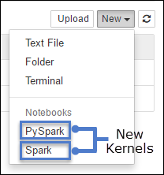

<!-- not suitable for Mooncake -->

<properties 
	pageTitle="Linux 上的 HDInsight Spark 群集所包含的 Jupyter 笔记本可用的内核 | Azure" 
	description="了解 HDInsight Linux 上的 Spark 群集可用的其他 Jupyter 笔记本内核。" 
	services="hdinsight" 
	documentationCenter="" 
	authors="nitinme" 
	manager="jhubbard" 
	editor="cgronlun"
	tags="azure-portal"/>

<tags 
	ms.service="hdinsight" 
	ms.workload="big-data" 
	ms.tgt_pltfrm="na" 
	ms.devlang="na" 
	ms.topic="article" 
	ms.date="10/05/2016" 
	wacn.date="02/14/2017" 
	ms.author="nitinme"/>

# HDInsight Linux 上的 Apache Spark 群集所包含的 Jupyter 笔记本可用的内核

在 HDInsight (Linux) 上的 Apache Spark 群集包含可用于测试应用程序的 Jupyter 笔记本。内核是可以运行和解释代码的程序。HDInsight Spark 群集提供了可在 Jupyter 笔记本中使用的两个内核。它们是：

1. **PySpark**（适用于以 Python 编写的应用程序）
2. **Spark**（适用于以 Scala 编写的应用程序）

本文介绍使用这些内核的方法与好处。

**先决条件：**

必须满足以下条件：

- Azure 订阅。请参阅[获取 Azure 试用版](/pricing/1rmb-trial/)。
- HDInsight Linux 上的 Apache Spark 群集。有关说明，请参阅 [Create Apache Spark clusters in Azure HDInsight](/documentation/articles/hdinsight-apache-spark-jupyter-spark-sql/)（在 Azure HDInsight 中创建 Apache Spark 群集）。

## 如何使用内核？ 

1. 在 [Azure 门户预览](https://portal.azure.cn/)上的启动板中，单击 Spark 群集的磁贴（如果已将它固定到启动板）。也可以单击“全部浏览”>“HDInsight 群集”导航到你的群集。

2. 在 Spark 群集边栏选项卡中单击“快速链接”，然后在“群集仪表板”边栏选项卡中单击“Jupyter 笔记本”。出现提示时，请输入群集的管理员凭据。

	> [AZURE.NOTE] 也可以在浏览器中打开以下 URL 来访问群集的 Jupyter 笔记本。将 __CLUSTERNAME__ 替换为群集的名称：
	>

	> `https://CLUSTERNAME.azurehdinsight.cn/jupyter`

2. 创建具有新内核的新笔记本。单击“新建”，然后单击“Pyspark”或“Spark”。Spark 内核适用于 Scala 应用程序，PySpark 内核适用于 Python 应用程序。

	

3. 此时将打开具有所选内核的新笔记本。

##  为何应使用 PySpark 或 Spark 内核？

下面是使用新内核的几项好处。

1. **预设上下文**。使用 Jupyter 笔记本随附的 **PySpark** 或 **Spark** 内核时，不需要先显式设置 Spark 或 Hive 上下文，即可开始使用开发的应用程序；这些上下文默认可供使用。这些上下文包括：

	* **sc** - 表示 Spark 上下文
	* **sqlContext** - 表示 Hive 上下文

	因此，不需要运行如下语句来设置上下文：

		###################################################
		# YOU DO NOT NEED TO RUN THIS WITH THE NEW KERNELS
		###################################################
		sc = SparkContext('yarn-client')
		sqlContext = HiveContext(sc)

	可以直接在应用程序中使用预设上下文。
	
2. **单元 magic**。PySpark 内核提供一些预定义的“magic”，这是可以结合 `%%` 调用的特殊命令（例如 `%%MAGIC` <args>）。magic 命令必须是代码单元中的第一个字，并且允许多行内容。magic 一字应该是单元中的第一个字。在 magic 前面添加任何内容（即使是注释）都会导致错误。有关 magic 的详细信息，请参阅[此文](http://ipython.readthedocs.org/en/stable/interactive/magics.html)。

	下表列出可通过内核提供的不同 magic。

	| Magic | 示例 | 说明 |
	|-----------|---------------------------------|--------------|
	| help | `%%help` | 生成所有可用 magic 的表，其中包含示例和说明 |
	| info | `%%info` | 输出当前 Livy 终结点的会话信息 |
	| 配置 | `%%configure -f` `{"executorMemory": "1000M"`, `"executorCores": 4`} | 配置用于创建会话的参数。如果已创建会话并且要删除然后重新创建该会话，则 force 标志 (-f) 是必需的。有关有效参数的列表，请查看 [Livy's POST /sessions Request Body](https://github.com/cloudera/livy#request-body)（Livy 的 POST /sessions 请求正文）。参数必须以 JSON 字符串传入，并且必须位于 magic 后面的下一行，如示例列中所示。 |
	| sql | `%%sql -o <variable name>`  `SHOW TABLES` | 针对 sqlContext 执行 Hive 查询。如果传递了 `-o` 参数，则查询的结果将以 [Pandas](http://pandas.pydata.org/) 数据帧的形式保存在 %%local Python 上下文中。 |
	| local | `%%local` `a=1` | 后续行中的所有代码将在本地执行。代码必须是有效的 Python 代码。 |
	| 日志 | `%%logs` | 输出当前 Livy 会话的日志。 |
	| 删除 | `%%delete -f -s <session number>` | 删除当前 Livy 终结点的特定会话。请注意，无法删除针对内核本身启动的会话。 |
	| cleanup | `%%cleanup -f` | 删除当前 Livy 终结点的所有会话，包括此笔记本的会话。force 标志 -f 是必需的。 |

	>[AZURE.NOTE] 除了 PySpark 内核添加的 magic 以外，还可以使用[内置的 IPython magic](https://ipython.org/ipython-doc/3/interactive/magics.html#cell-magics)（包括 `%%sh`）。可以使用 `%%sh` magic 在群集头节点上运行脚本和代码块。

3. **自动可视化**。**Pyspark** 内核自动将 Hive 和 SQL 查询的输出可视化。可以选择多种不同类型的视觉效果，包括表、饼图、折线图、分区图和条形图。

## %%sql magic 支持的参数

%%sql magic 支持不同的参数，可以使用这些参数控制运行查询时收到的输出类型。下表列出了输出。

| 参数 | 示例 | 说明 |
|-----------|---------------------------------|--------------|
| -o | `-o <VARIABLE NAME>` | 使用此参数将查询结果以 [Pandas](http://pandas.pydata.org/) 数据帧的形式保存在 %%local Python 上下文中。数据帧变量的名称是指定的变量名称。 |
| -q | `-q` | 使用此参数可关闭单元可视化。如果不想自动将单元内容可视化，而只想将它作为数据帧捕获，可以使用 `-q -o <VARIABLE>`。如果想要关闭可视化而不捕获结果（例如，运行诸如 `CREATE TABLE` 语句的有副作用的 SQL 查询），只需使用不带 `-o` 参数的 `-q`。 |
| -m | `-m <METHOD>` | 其中，**METHOD** 是 **take** 或 **sample**（默认为 **take**）。如果方法为 **take**，内核将从 MAXROWS 指定的结果数据集顶部选择元素（如此表中稍后所述）。如果方法为 **sample**，内核将根据 `-r` 参数针对数据集的元素随机采样，如此表中稍后所述。 |
| -r | `-r <FRACTION>` | 此处的 **FRACTION** 是介于 0.0 与 1.0 之间的浮点数。如果 SQL 查询的采样方法为 `sample`，则内核将针对结果集元素的指定分数随机采样；例如，如果使用参数 `-m sample -r 0.01` 运行 SQL 查询，则会从结果行中随机采样 1%。 |
| -n | `-n <MAXROWS>` | **MAXROWS** 是整数值。内核将输出行的数目限制为 **MAXROWS**。如果 **MAXROWS** 是负数（例如 **-1**），结果集中的行数将不受限制。 |

**示例：**

	%%sql -q -m sample -r 0.1 -n 500 -o query2 
	SELECT * FROM hivesampletable

上述语句执行以下操作：

* 从 **hivesampletable** 中选择所有记录。
* 由于使用了 -q，因此将关闭自动可视化。
* 由于使用了 `-m sample -r 0.1 -n 500`，因此将从 hivesampletable 的行中随机采样 10%，并将结果集的大小限制为 500 行。
* 最后，由于使用了 `-o query2`，因此将输出保存到名为 **query2** 的数据帧中。
	

## 使用新内核时的注意事项

无论使用哪种内核（PySpark 或 Spark），使笔记本一直保持运行都会消耗群集资源。使用这些内核时，由于上下文是预设的，单单退出笔记本并不会终止上下文，因此会继续占用群集资源。使用 PySpark 和 Spark 内核时，合理的做法是使用笔记本“文件”菜单中的“关闭并停止”选项。这样就会终止上下文，然后退出笔记本。

## 举例说明

打开 Jupyter 笔记本时，可以在根级别看到两个文件夹。

* **PySpark** 文件夹包含使用新 **Python** 内核的示例笔记本。
* **Scala** 文件夹包含使用新 **Spark** 内核的示例笔记本。

可以从 **PySpark** 或 **Spark** 文件夹打开 **00 - [READ ME FIRST] Spark Magic Kernel Features** 笔记本，了解各种可用的 magic。也可以使用这两个文件夹下面提供的其他笔记本示例，了解如何在 HDInsight Spark 群集上实现不同的 Jupyter 笔记本使用方案。

##  笔记本存储在何处？

Jupyter 笔记本保存在与 **/HdiNotebooks** 文件夹下面的群集关联的存储帐户中。可以从 WASB 访问在 Jupyter 内部创建的笔记本、文本文件和文件夹。例如，如果使用 Jupyter 创建文件夹 **myfolder** 和笔记本 **myfolder/mynotebook.ipynb**，可以通过 `wasbs:///HdiNotebooks/myfolder/mynotebook.ipynb` 访问该笔记本。反之亦然，如果直接将笔记本上载到 `/HdiNotebooks/mynotebook1.ipynb` 中的存储帐户，则可以从 Jupyter 查看该笔记本。即使删除了群集，笔记本也仍会保留在存储帐户中。

将笔记本保存到存储帐户的方式与 HDFS 兼容。因此，如果通过 SSH 访问群集，可以使用如下所示的文件管理命令：

	hdfs dfs -ls /HdiNotebooks             				  # List everything at the root directory - everything in this directory is visible to Jupyter from the home page
	hdfs dfs -copyToLocal /HdiNotebooks    				# Download the contents of the HdiNotebooks folder
	hdfs dfs -copyFromLocal example.ipynb /HdiNotebooks   # Upload a notebook example.ipynb to the root folder so it's visible from Jupyter

笔记本还会保存到头节点 `/var/lib/jupyter`，以防止访问群集的存储帐户时出现问题。

## 支持的浏览器
Google Chrome 仅支持针对 HDInsight Spark 群集运行的 Jupyter 笔记本。

## 反馈

新内核正处于发展阶段，一段时间后将变得成熟。这可能也意味着，API 可随着这些内核的成熟而改变。如果在使用这些新内核时有任何反馈，我们将不胜感激。这对于内核最终版本的定调会很有帮助。可以在本文末尾的“意见”部分下面填写意见/反馈。

## 另请参阅

* [概述：Azure HDInsight 上的 Apache Spark](/documentation/articles/hdinsight-apache-spark-overview/)

### 方案

* [Spark 和 BI：使用 HDInsight 中的 Spark 和 BI 工具执行交互式数据分析](/documentation/articles/hdinsight-apache-spark-use-bi-tools/)

* [Spark 和机器学习：使用 HDInsight 中的 Spark 对使用 HVAC 数据生成温度进行分析](/documentation/articles/hdinsight-apache-spark-ipython-notebook-machine-learning/)

* [Spark 流式处理：使用 HDInsight 中的 Spark 生成实时流式处理应用程序](/documentation/articles/hdinsight-apache-spark-eventhub-streaming/)

### 创建和运行应用程序

* [使用 Livy 在 Spark 群集中远程运行作业](/documentation/articles/hdinsight-apache-spark-livy-rest-interface/)

### 工具和扩展

* [在 HDInsight 上的 Spark 群集中使用 Zeppelin 笔记本](/documentation/articles/hdinsight-apache-spark-use-zeppelin-notebook/)

* [Use external packages with Jupyter notebooks（将外部包与 Jupyter 笔记本配合使用）](/documentation/articles/hdinsight-apache-spark-jupyter-notebook-use-external-packages/)

* [Install Jupyter on your computer and connect to an HDInsight Spark cluster（在计算机上安装 Jupyter 并连接到 HDInsight Spark 群集）](/documentation/articles/hdinsight-apache-spark-jupyter-notebook-install-locally/)

### 管理资源

* [管理 Azure HDInsight 中 Apache Spark 群集的资源](/documentation/articles/hdinsight-apache-spark-resource-manager/)

* [Track and debug jobs running on an Apache Spark cluster in HDInsight（跟踪和调试 HDInsight 中的 Apache Spark 群集上运行的作业）](/documentation/articles/hdinsight-apache-spark-job-debugging/)

<!---HONumber=Mooncake_0926_2016-->