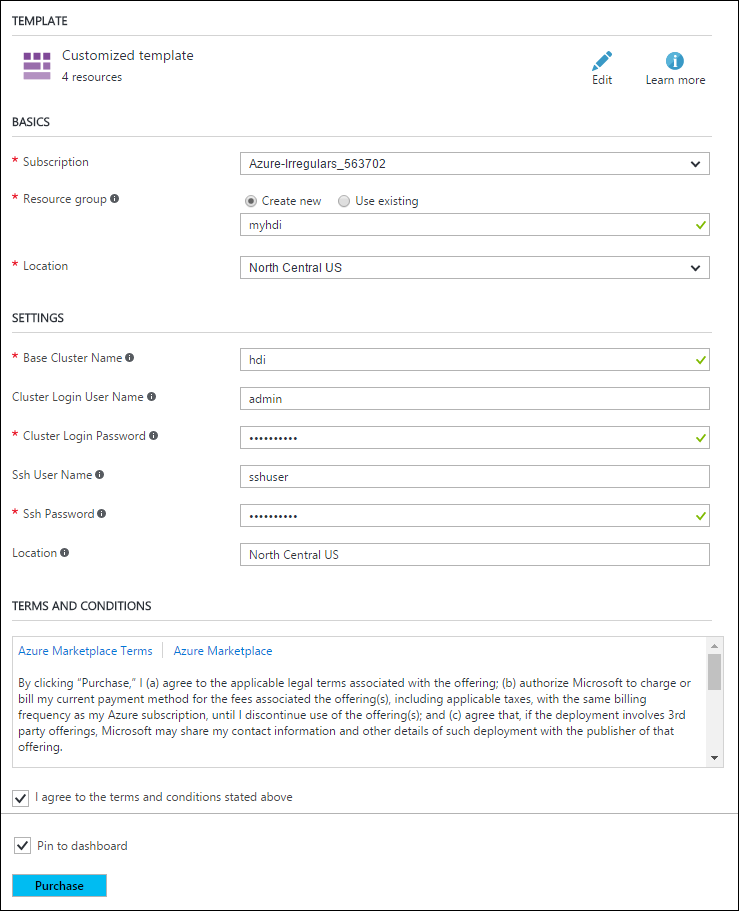
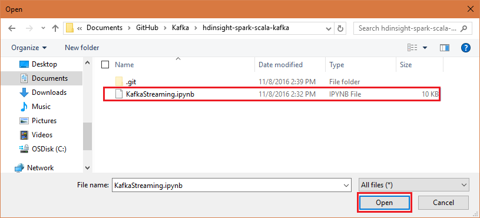

<!-- not suitable for Mooncake -->

<properties
    pageTitle="在 HDInsight 上将 Apache Spark 与 Kafka 配合使用 | Azure"
    description="了解如何在 HDInsight 上使用 Spark 读取数据以及将数据写入到 HDInsight 上的 Kafka 群集。本示例在 Jupyter Notebook 中使用 Scala 将随机数据写入到 HDInsight 上的 Kafka，然后使用 Spark 流式处理重新读取它。"
    services="hdinsight"
    documentationcenter=""
    author="Blackmist"
    manager="jhubbard"
    editor="cgronlun" />
<tags 
    ms.assetid="dd8f53c1-bdee-4921-b683-3be4c46c2039"
    ms.service="hdinsight"
    ms.devlang=""
    ms.topic="article"
    ms.tgt_pltfrm="na"
    ms.workload="big-data"
    ms.date="11/14/2016"
    wacn.date="02/06/2017"
    ms.author="larryfr" />

# 在 HDInsight 上将 Apache Spark 与 Kafka（预览版）配合使用

可以使用 Apache Spark 将数据流式传入或流式传出 Apache Kafka。在本文档中，将了解如何使用 Jupyter Notebook 从 HDInsight 上的 Spark 将数据流式传入或流式传出 Kafka。

> [AZURE.NOTE]
本文档中的步骤将创建一个 Azure 资源组，其中同时包含 HDInsight 上的 Spark 和 HDInsight 上的 Kafka 群集。这些群集都位于一个 Azure 虚拟网络中，这样 Spark 群集便可与 Kafka 群集直接通信。
> 
> 完成本文档中的步骤后，请记得删除这些群集，以避免产生额外费用。

## 先决条件

* Azure 订阅

* SSH 客户端（需要 `ssh` 和 `scp` 命令）- 有关将 SSH 与 HDInsight 配合使用的详细信息，请参阅以下文档：

    * [Use SSH with Linux-based HDInsight from Linux, Unix, and Mac OS](/documentation/articles/hdinsight-hadoop-linux-use-ssh-unix/)（通过 Linux、Unix 和 Mac OS 将 SSH 与基于 Linux 的 HDInsight 配合使用）

    * [Use SSH with Linux-based HDInsight from Windows](/documentation/articles/hdinsight-hadoop-linux-use-ssh-windows/)（通过 Windows 将 SSH 与基于 Linux 的 HDInsight 配合使用）

* [cURL](https://curl.haxx.se/) - 跨平台实用程序，用于发出 HTTP 请求。

* [jq](https://stedolan.github.io/jq/) - 跨平台实用程序，用于分析 JSON 文档。

## 创建群集

HDInsight 上的 Apache Kafka 不提供通过公共 Internet 访问 Kafka 代理的权限。若要与 Kafka 通信，必须与 Kafka 群集中的节点在同一 Azure 虚拟网络中。在此示例中，Kafka 群集和 Spark 群集都位于一个 Azure 虚拟网络中。下图显示了这两个群集之间通信的流动方式：

  

> [AZURE.NOTE]
虽然 Kafka 本身的通信限于虚拟网络中，但可以通过 Internet 访问群集上的其他服务（如 SSH 和 Ambari）。有关 HDInsight 所提供的公共端口的详细信息，请参阅 [HDInsight 使用的端口和 URI](/documentation/articles/hdinsight-hadoop-port-settings-for-services/)。

虽然可以手动创建 Azure 虚拟网络、Kafka 和 Spark 群集，但是使用 Azure Resource Manager 模板会更容易。使用以下步骤将 Azure 虚拟网络、Kafka 和 Spark 群集部署到 Azure 订阅。

1. 使用以下按钮登录到 Azure，然后在 Azure 门户预览中打开模板。
    
    
    
    Azure Resource Manager 模板位于 **https://hditutorialdata.blob.core.windows.net/armtemplates/create-linux-based-kafka-spark-cluster-in-vnet.json**。

2. 使用以下信息填充“自定义部署”边栏选项卡上的条目：
   
      

   
    * **资源组**：创建一个组或选择现有组。此组包含 HDInsight 群集。

    * **位置**：选择离你近的地理位置。此位置必须与“设置”部分中的位置匹配。

    * **基群集名称**：此值用作 Spark 和 Kafka 群集的基名称。例如，输入 **hdi** 将创建名为“spark-hdi”的 Spark 群集和名为“kafka-hdi”的 Kafka 群集。

    * **群集登录用户名**：Spark 和 Kafka 群集的管理员用户名。

    * **群集登录密码**：Spark 和 Kafka 群集的管理员用户密码。

    * **SSH 用户名**：要为 Spark 和 Kafka 群集创建的 SSH 用户。

    * **SSH 密码**：Spark 和 Kafka 群集的 SSH 用户的密码。

    * **位置**：在其中创建群集的区域。

3. 阅读**条款和条件**，然后选择“我同意上述条款和条件”。

4. 最后，选中“固定到仪表板”，然后选择“购买”。创建群集大约需要 20 分钟时间。

创建资源后，系统会将用户重定向到包含群集和 Web 仪表板的资源组的边栏选项卡。

  

> [AZURE.IMPORTANT]
请注意，HDInsight 群集的名称为 **spark-BASENAME** 和 **kafka-BASENAME**，其中“BASENAME”是用户提供给模板的名称。在后续步骤中连接到群集时，会使用这些名称。

## 获取代码

本文档中介绍的示例的代码位于 [https://github.com/Azure-Samples/hdinsight-spark-scala-kafka](https://github.com/Azure-Samples/hdinsight-spark-scala-kafka) 中。

## 了解代码

此示例使用 Jupyter Notebook 中的 Scala 应用程序。Notebook 中的代码依赖于以下数据块：

* __Kafka 中转站__：中转站进程在 Kafka 群集的每个 workernode 上运行。将数据写入 Kafka 的生产者组件需要中转站列表。

* __Zookeeper 主机__：使用（读取）Kafka 中的数据时使用 Kafka 群集的 Zookeeper 主机。

* __主题名称__：将数据写入到及从中读取数据的主题的名称。此示例需要名为 `sparktest` 的主题。

有关如何获取 Kafka 中转站和 Zookeeper 主机信息的信息，请参阅 [Kafka 主机信息](#kafkahosts)部分。

Notebook 中的代码执行以下任务：

* 创建一个从名为 `sparktest` 的 Kafka 主题中读取数据的使用者，此使用者对数据中的每个单词计数，并将单词和计数存储到名为 `wordcounts` 的临时表中。

* 创建一个将随机句子写入名为 `sparktest` 的 Kafka 主题的生产者。

* 从 `wordcounts` 表中选择数据以显示计数。

项目中的每个单元格包含注释或文本部分，说明代码的作用。

##Kafka 主机信息

创建使用 HDInsight 上的 Kafka 的应用程序时应执行的第一个操作是获取 Kafka 中转站和 Kafka 群集的 Zookeeper 主机信息。客户端应用程序使用这些信息与 Kafka 通信。

> [AZURE.NOTE]
Kafka 中转站和 Zookeeper 主机不可通过 Internet 直接访问。使用 Kafka 的任何应用程序必须在 Kafka 群集上运行或与 Kafka 群集在同一 Azure 虚拟网络中。在此示例中，示例在同一虚拟网络中的 HDInsight 上的 Spark 群集上运行。

从开发环境中，使用以下命令检索中转站和 Zookeeper 信息。将 __PASSWORD__ 替换为创建群集时使用的登录名 (admin) 密码。将 __BASENAME__ 替换为创建群集时使用的基名称。

* 若要获取 __Kafka 中转站__信息，请执行以下操作：

        curl -u admin:PASSWORD -G "https://kafka-BASENAME.azurehdinsight.cn/api/v1/clusters/kafka-BASENAME/services/KAFKA/components/KAFKA_BROKER" | jq -r '["(.host_components[].HostRoles.host_name):9092"] | join(",")'

    > [AZURE.IMPORTANT]
    通过 Windows PowerShell 使用此命令时，可能会收到了有关命令行程序用引号括起来的错误。如果是这样，请使用以下命令：`curl -u admin:PASSWORD -G "https://kafka-BASENAME.azurehdinsight.cn/api/v1/clusters/kafka-BASENAME/services/KAFKA/components/KAFKA\_BROKER" | jq -r '["""(.host\_components.HostRoles.host\_name):9092"""] | join(""",""")'

* 若要获取 __Zookeeper 主机__信息，请执行以下操作：

        curl -u admin:PASSWORD -G "https://kafka-BASENAME.azurehdinsight.cn/api/v1/clusters/kafka-BASENAME/services/ZOOKEEPER/components/ZOOKEEPER_SERVER" | jq -r '["(.host_components[].HostRoles.host_name):2181"] | join(",")'
    
    > [AZURE.IMPORTANT]
    通过 Windows PowerShell 使用此命令时，可能会收到了有关命令行程序用引号括起来的错误。如果是这样，请使用以下命令：`curl -u admin:PASSWORD -G "https://kafka-BASENAME.azurehdinsight.cn/api/v1/clusters/kafka-BASENAME/services/ZOOKEEPER/components/ZOOKEEPER_SERVER" | jq -r '["""(.host_components[].HostRoles.host_name):2181"""] | join(""",""")'`

这两个命令返回的信息类似于以下文本：

* __Kafka 中转站__：`wn0-kafka.4rf4ncirvydube02fuj0gpxp4e.ex.internal.chinacloudapp.cn:9092,wn1-kafka.4rf4ncirvydube02fuj0gpxp4e.ex.internal.chinacloudapp.cn:9092`

* __Zookeeper 主机__：`zk0-kafka.4rf4ncirvydube02fuj0gpxp4e.ex.internal.chinacloudapp.cn:2181,zk1-kafka.4rf4ncirvydube02fuj0gpxp4e.ex.internal.chinacloudapp.cn:2181,zk2-kafka.4rf4ncirvydube02fuj0gpxp4e.ex.internal.chinacloudapp.cn:2181`

> [AZURE.IMPORTANT]
请保存此信息，因为在本文档的几个步骤中将用到它。

## 使用 Jupyter Notebook

若要使用示例 Jupyter Notebook，必须将其上载到 Spark 群集上的 Jupyter Notebook 服务器。使用以下步骤上载 Notebook：

1. 在 Web 浏览器中，使用以下 URL 连接到 Spark 群集上的 Jupyter Notebook 服务器。将 __BASENAME__ 替换为创建群集时使用的基名称。

        https://spark-BASENAME.azurehdinsight.cn/jupyter

    出现提示时，输入在创建群集时使用的群集登录名 (admin) 和密码。

2. 使用页面右上角的“上载”按钮上载 `KafkaStreaming.ipynb` 文件。在文件浏览器对话框中选择文件并选择“打开”。

      

      

3. 在 Notebook 列表中查找 __KafkaStreaming.ipynb__ 条目，然后选择它旁边的“上载”按钮。

      

4. 上载该文件后，选择 __KafkaStreaming.ipynb__ 条目以打开 Notebook。若要完成此示例，按照 Notebook 中的说明操作。

## 删除群集

[AZURE.INCLUDE [delete-cluster-warning](../../includes/hdinsight-delete-cluster-warning.md)]

由于本文档中的步骤在同一 Azure 资源组中创建两个群集，因此可以在 Azure 门户预览中删除该资源组。删除组时会删除按照本文档操作创建的所有资源（Azure 虚拟网络和群集使用的存储帐户）。

## 后续步骤

在本文档中，你学习了如何使用 Spark 读取和写入到 Kafka。使用以下链接可发现使用 Kafka 的其他方式：

* [HDInsight 上的 Apache Kafka 入门](/documentation/articles/hdinsight-apache-kafka-get-started/)
* [使用 MirrorMaker 在 HDInsight 上创建 Kafka 的副本](/documentation/articles/hdinsight-apache-kafka-mirroring/)
* [在 HDInsight 上将 Apache Storm 与 Kafka 配合使用](/documentation/articles/hdinsight-apache-storm-with-kafka/)

<!---HONumber=Mooncake_1219_2016-->