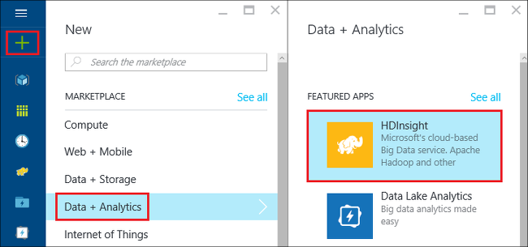
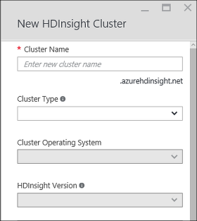

<!-- not suitable for Mooncake -->

<properties
   pageTitle="Hadoop 教程：Windows 上的 Hadoop 入门 | Azure"
   description="HDInsight 中的 Hadoop 入门。学习如何在 Windows 上创建 Hadoop 群集、对数据运行 Hive 查询，以及在 Excel 中分析输出。"
   keywords="hadoop 教程,windows 上的 hadoop,hadoop 群集,了解 hadoop, hive 查询"
   services="hdinsight"
   documentationCenter=""
   authors="nitinme"
   manager="jhubbard"
   editor="cgronlun"
   tags="azure-portal"/>

<tags
   ms.service="hdinsight"
   ms.devlang="na"
   ms.topic="article"
   ms.tgt_pltfrm="na"
   ms.workload="big-data"
   ms.date="03/07/2016"
   wacn.date="02/06/2017"
   ms.author="nitinme"/>  

# Hadoop 教程：在 Windows 上开始使用 HDInsight 中的 Hadoop

> [AZURE.SELECTOR]
- [基于 Linux](/documentation/articles/hdinsight-hadoop-linux-tutorial-get-started/)
- [基于 Windows](/documentation/articles/hdinsight-hadoop-tutorial-get-started-windows/)

为了帮助你了解并开始使用 Windows 上的 HDInsight，本教程说明了如何对 Hadoop 群集中的非结构化数据运行 Hive 查询，然后在 Microsoft Excel 中分析结果。

>[AZURE.NOTE] 此文档中的信息特定于基于 Windows 的 HDInsight 群集。有关基于 Linux 的群集的信息，请参阅 [Hadoop 教程：在 HDInsight 中使用基于 Linux 的 Hadoop 入门](/documentation/articles/hdinsight-hadoop-linux-tutorial-get-started/)。

假设你具有一个大型非结构化数据集，想要对其运行 Hive 查询以提取一些有意义的信息。这正是你在本教程中要实现的目标。下面说明了如何实现此目标：

   ![Hadoop 教程：创建帐户；创建 Hadoop 群集；提交 Hive 查询；在 Excel 中分析数据。][image-hdi-getstarted-flow]

观看本教程的演示视频，以了解 HDInsight 上的 Hadoop：

![第一份 Hadoop 教程的视频：在 Hadoop 群集上提交 Hive 查询，然后在 Excel 中分析结果。][img-hdi-getstarted-video]  

**[观看 YouTube 上的 HDInsight Hadoop 教程](https://www.youtube.com/watch?v=Y4aNjnoeaHA&list=PLDrz-Fkcb9WWdY-Yp6D4fTC1ll_3lU-QS)**

Microsoft 还提供了 HDInsight Emulator for Azure（以前称作 *Microsoft HDInsight 开发者预览版*），与 Azure HDInsight 的通用版本结合使用。Emulator 针对开发人员方案，仅支持单节点部署。有关如何使用 HDInsight Emulator 的信息，请参阅 [HDInsight Emulator 入门][hdinsight-emulator]。

[AZURE.INCLUDE [delete-cluster-warning](../../includes/hdinsight-delete-cluster-warning.md)]

## 先决条件

在开始学习这篇针对 Windows 上的 Hadoop 的教程之前，你必须具有：

- **一个 Azure 订阅**。请参阅[获取 Azure 试用版](/pricing/1rmb-trial/)。
- 装有 Office 2013 Professional Plus、Office 365 Pro Plus、Excel 2013 Standalone 或 Office 2010 Professional Plus 的**工作站计算机**。

### 访问控制要求

[AZURE.INCLUDE [access-control](../../includes/hdinsight-access-control-requirements.md)]

## 创建 Hadoop 群集

当你创建群集时，便会创建包含 Hadoop 和相关应用程序的 Azure 计算资源。在本部分，你将创建一个 HDInsight 版本 3.2 群集。也可以为其他版本创建 Hadoop 群集。有关说明，请参阅[使用自定义选项创建 HDInsight 群集][hdinsight-provision]。有关 HDInsight 版本及其 SLA 的信息，请参阅 [HDInsight 组件版本](/documentation/articles/hdinsight-component-versioning/)。

**创建 Hadoop 群集**

1. 登录到 [Azure 门户预览](https://portal.azure.cn/)。
2. 单击“新建”，单击“数据分析”，然后单击“HDInsight”。该门户将打开“新建 HDInsight 群集”边栏选项卡。

      

3. 输入或选择以下项：

	  

	
	|字段名称| 值|
	|----------|------|
	|群集名称| 用于标识群集的唯一名称|
	|群集类型| 对于本教程，选择“Hadoop”。 |
	|群集操作系统| 对于本教程，选择“Windows Server 2012 R2 Datacenter”。|
	|HDInsight 版本| 对于本教程，选择最新版本。|
	|订阅| 选择将用于此群集的 Azure 订阅。|
	|资源组 | 选择现有 Azure 资源组或创建新的资源组。基本 HDInsight 群集包含群集及其默认存储帐户。为便于管理，可以将这两者分组到一个资源组。|
	|凭据| 输入群集登录用户名和密码。基于 Windows 的群集可以有 2 个用户帐户。群集用户（或 HTTP 用户）用于管理群集和提交作业。可以选择创建远程桌面 (RDP) 用户帐户，用于远程连接到群集。如果你选择启用远程桌面，则将创建 RDP 用户帐户。|
	|数据源| 单击“新建”以创建新的默认 Azure 存储帐户。使用群集名称作为默认容器名称。每个 HDInsight 群集都在 Azure 存储帐户中有一个默认 Blob 容器。默认 Azure 存储帐户的位置确定 HDInsight 群集的位置。|
	|节点定价层| 对于本教程，将 1 个或 2 个工作节点用于默认工作节点和头节点定价层。|
	|可选配置| 跳过此部分。|

9. 在“新建 HDInsight 群集”边栏选项卡上，确保选中“固定到启动板”，然后单击“创建”。这将会创建群集，并将该群集的磁贴添加到 Azure 门户的启动板。该图标指示正在创建群集，完成创建后，将改为显示 HDInsight 图标。

	| 在创建过程中 | 创建完成 |
	| ------------------ | --------------------- |
	|  |  |

	> [AZURE.NOTE] 创建群集需要一些时间，通常约 15 分钟左右。使用启动板上的磁贴或页面左侧的“通知”项检查创建过程。

10. 创建完成后，在启动板中单击群集磁贴，以启动群集边栏选项卡。

## 从门户运行 Hive 查询
现在，你的 HDInsight 群集已创建完毕，下一步是运行 Hive 作业以查询示例 Hive 表。我们将使用 HDInsight 群集随附的 *hivesampletable*。该表包含有关移动设备制造商、平台和型号的数据。对此表运行 Hive 查询可按特定制造商检索移动设备的数据。

> [AZURE.NOTE] 用于 Visual Studio 的 HDInsight 工具随附了用于 .NET 的 Azure SDK 2.5 或更高版本。使用 Visual Studio 中的工具可以连接到 HDInsight 群集、创建 Hive 表和运行 Hive 查询。有关详细信息，请参阅 [用于 Visual Studio 的 HDInsight Hadoop 工具入门][1]。

**从群集仪表板运行 Hive 作业**

1. 登录到 [Azure 门户预览](https://portal.azure.cn/)。
2. 依次单击“全部浏览”和“HDInsight 群集”查看群集列表，其中包括你刚刚在上一部分中创建的群集。
3. 单击要用于运行 Hive 作业的群集名称，然后单击边栏选项卡顶部的“仪表板”。
4. 这会在另一个浏览器选项卡中打开一个网页。输入 Hadoop 用户帐户和密码。默认用户名为 **admin**；密码是你在创建群集时所输入的密码。
5. 在仪表板中，单击“Hive 编辑器”选项卡。将打开以下网页。

	![HDInsight 群集仪表板中的“Hive 编辑器”选项卡。][img-hdi-dashboard]  

	页面顶部有多个选项卡。默认选项卡为“Hive 编辑器”，而其他选项卡为“作业历史记录”和“文件浏览器”。使用仪表板可以提交 Hive 查询、检查 Hadoop 作业日志，以及浏览 WASB 文件。

	> [AZURE.NOTE] 请注意，网页的 URL 为 *&lt;群集名称&gt;.azurehdinsight.cn*。因此，如果不从门户打开仪表板，也可以在 Web 浏览器中使用 URL 打开仪表板。

6. 在“Hive 编辑器”选项卡上，为“查询名称”输入 **HTC20**。查询名称为作业标题。在查询窗格中，按下图所示输入 Hive 查询：

	![在 Hive 编辑器的查询窗格中输入的 Hive 查询。][img-hdi-dashboard-query-select]  

4. 单击“提交”。片刻之后即可返回结果。屏幕将每隔 30 秒刷新一次。你也可以单击“刷新”来刷新屏幕。

    ![在群集仪表板底部列出的 Hive 查询结果。][img-hdi-dashboard-query-select-result]  

5. 在状态显示作业已完成后，单击屏幕上的查询名称以查看输出。记下“作业开始时间(UTC)”。稍后需要用到此值。

    ![在 HDInsight 群集仪表板的“作业历史记录”选项卡中列出的“作业开始时间”。][img-hdi-dashboard-query-select-result-output]  

    该页面还显示“作业输出”和“作业日志”。你也可以选择下载输出文件 (\_stdout) 和日志文件 (\_stderr)。

**浏览到输出文件**

1. 在群集仪表板中，单击“文件浏览器”。
2. 单击你的存储帐户名称，单击容器名称（与群集名称相同），然后单击“用户”。
3. 单击“admin”，然后单击其上次修改时间比你前面记下的作业开始时间稍晚的 GUID。复制此 GUID。在后一个部分将要用到它。

   	![在“文件浏览器”选项卡中列出的 Hive 查询输出文件 GUID。][img-hdi-dashboard-query-browse-output]  

##连接到 Excel 的 Microsoft 商业智能工具

你可以使用 Microsoft Excel 的 Power Query 附加组件将作业输出从 HDInsight 导入到 Excel 中，从中可以使用 Microsoft 商业智能工具进一步分析结果。

要完成本部分教程，必须已安装 Excel 2013 或 2010。

**下载 Microsoft Power Query for Excel**

- 从 [Microsoft 下载中心](http://www.microsoft.com/download/details.aspx?id=39379)下载 Microsoft Power Query for Microsoft Excel 并将其安装。

**导入 HDInsight 数据**

1. 打开 Excel，然后创建一个新的工作簿。
3. 依次单击“Power Query”菜单、“从其他源”和“从 Azure HDInsight”。

	![为 Azure HDInsight 打开的 Excel PowerQuery 导入菜单。][image-hdi-gettingstarted-powerquery-importdata]  

3. 输入与你的群集关联的 Azure Blob 存储帐户的“帐户名称”，然后单击“确定”。（这是先前在教程中创建的存储帐户。）
4. 输入 Azure Blob 存储帐户的“帐户密钥”，然后单击“保存”。
5. 在右窗格中，双击 Blob 名称。默认情况下，该 Blob 名称与群集名称相同。

6. 在“名称”列中找到 **stdout**。确认对应“文件夹路径”列中的 GUID 是否与你前面记下的 GUID 匹配。若匹配，则表明输出数据与所提交的作业相对应。单击 **stdout** 列左侧的“二进制”。

	![按内容列表中的 GUID 查找数据输出。][image-hdi-gettingstarted-powerquery-importdata2]  

9. 单击左上角的“关闭并加载”以将 Hive 作业输出导入到 Excel 中。

##运行示例

HDInsight 群集提供包括入门库的查询控制台以直接从门户运行示例。通过浏览一些基本方案，你可以使用示例了解如何使用 HDInsight。这些示例提供所有必要组件，比如要分析的数据和要对数据运行的查询。若要了解有关入门库中的示例的详细信息，请参阅[使用 HDInsight 入门库了解 HDInsight 中的 Hadoop](/documentation/articles/hdinsight-learn-hadoop-use-sample-gallery/)。

**运行示例**

1. 在 Azure 门户预览启动板中，单击刚创建的群集所对应的磁贴。
 
2. 在新的边栏选项卡中，单击“仪表板”。出现提示时，输入群集的管理员用户名和密码。

	  

 
3. 从打开的网页中，单击“入门库”选项卡，然后在“使用示例数据的解决方案”类别下，单击要运行的示例。按照网页上的说明完成示例。下表列出了几个示例，并提供了有关每个示例的作用的详细信息。

示例 | 它有什么作用？
------ | ---------------
[传感器数据分析][hdinsight-sensor-data-sample] | 了解如何使用 HDInsight 处理加热、通风和空调 (HVAC) 系统产生的历史数据，以识别无法可靠地保持设定温度的系统
[网站日志分析][hdinsight-weblogs-sample] | 了解如何使用 HDInsight 分析网站日志文件，以了解一天中从外部网站对该网站的访问次数，以及用户遇到的网站错误汇总
[Twitter 趋势分析](/documentation/articles/hdinsight-analyze-twitter-data/) | 了解如何使用 HDInsight 分析 Twitter 中的趋势。

##删除群集

[AZURE.INCLUDE [delete-cluster-warning](../../includes/hdinsight-delete-cluster-warning.md)]

##后续步骤
在本 Hadoop 教程中，你已学习如何在 Windows 上的HDInsight 中创建 Hadoop 群集、如何对数据运行 Hive 查询，以及如何将结果导入到 Excel 中，在 Excel 中，可以使用商业智能工具进一步处理结果以及以图形方式显示结果。若要了解更多信息，请参阅以下教程：

- [开始使用适用于 Visual Studio 的 HDInsight 工具][1]
- [HDInsight Emulator 入门][hdinsight-emulator]
- [将 Azure Blob 存储与 HDInsight 配合使用][hdinsight-storage]
- [使用 PowerShell 管理 HDInsight][hdinsight-admin-powershell]
- [将数据上载到 HDInsight][hdinsight-upload-data]
- [将 MapReduce 与 HDInsight 配合使用][hdinsight-use-mapreduce]
- [将 Hive 与 HDInsight 配合使用][hdinsight-use-hive]
- [将 Pig 与 HDInsight 配合使用][hdinsight-use-pig]
- [将 Oozie 与 HDInsight 配合使用][hdinsight-use-oozie]
- [为 HDInsight 开发 Java MapReduce 程序][hdinsight-develop-mapreduce]

[1]: /documentation/articles/hdinsight-hadoop-visual-studio-tools-get-started/

[hdinsight-versions]: /documentation/articles/hdinsight-component-versioning/

[hdinsight-provision]: /documentation/articles/hdinsight-provision-clusters/
[hdinsight-admin-powershell]: /documentation/articles/hdinsight-administer-use-powershell/
[hdinsight-upload-data]: /documentation/articles/hdinsight-upload-data/
[hdinsight-use-mapreduce]: /documentation/articles/hdinsight-use-mapreduce/
[hdinsight-use-hive]: /documentation/articles/hdinsight-use-hive/
[hdinsight-use-pig]: /documentation/articles/hdinsight-use-pig/
[hdinsight-use-oozie]: /documentation/articles/hdinsight-use-oozie/
[hdinsight-storage]: /documentation/articles/hdinsight-hadoop-use-blob-storage/
[hdinsight-emulator]: /documentation/articles/hdinsight-hadoop-emulator-get-started/
[hdinsight-develop-mapreduce]: /documentation/articles/hdinsight-develop-deploy-java-mapreduce-linux/
[hadoop-hdinsight-intro]: /documentation/articles/hdinsight-hadoop-introduction/
[hdinsight-weblogs-sample]: /documentation/articles/hdinsight-hive-analyze-website-log/
[hdinsight-sensor-data-sample]: /documentation/articles/hdinsight-hive-analyze-sensor-data/

[azure-purchase-options]: /pricing/overview/
[azure-member-offers]: /pricing/member-offers/
[azure-trial]: /pricing/1rmb-trial/
[azure-management-portal]: https://portal.azure.cn/
[azure-create-storageaccount]: /documentation/articles/storage-create-storage-account/

[apache-hadoop]: http://hadoop.apache.org/
[apache-hive]: https://cwiki.apache.org/confluence/display/Hive/Home%3bjsessionid=AF5B37E667D7DBA633313BB2280C9072
[apache-mapreduce]: http://wiki.apache.org/hadoop/MapReduce
[apache-hdfs]: http://hadoop.apache.org/docs/r1.0.4/hdfs_design.html
[hdinsight-hbase-custom-provision]: /documentation/articles/hdinsight-hbase-tutorial-get-started-v1/

[powershell-download]: http://go.microsoft.com/fwlink/p/?linkid=320376&clcid=0x409
[powershell-install-configure]: /documentation/articles/powershell-install-configure/
[powershell-open]: /documentation/articles/powershell-install-configure/#step-1-install

[img-hdi-dashboard]: ./media/hdinsight-hadoop-tutorial-get-started-windows/HDI.dashboard.png
[img-hdi-dashboard-query-select]: ./media/hdinsight-hadoop-tutorial-get-started-windows/HDI.dashboard.query.select.png
[img-hdi-dashboard-query-select-result]: ./media/hdinsight-hadoop-tutorial-get-started-windows/HDI.dashboard.query.select.result.png
[img-hdi-dashboard-query-select-result-output]: ./media/hdinsight-hadoop-tutorial-get-started-windows/HDI.dashboard.query.select.result.output.png
[img-hdi-dashboard-query-browse-output]: ./media/hdinsight-hadoop-tutorial-get-started-windows/HDI.dashboard.query.browse.output.png

[img-hdi-getstarted-video]: ./media/hdinsight-hadoop-tutorial-get-started-windows/hdi-get-started-video.png

[image-hdi-storageaccount-quickcreate]: ./media/hdinsight-hadoop-tutorial-get-started-windows/HDI.StorageAccount.QuickCreate.png
[image-hdi-clusterstatus]: ./media/hdinsight-hadoop-tutorial-get-started-windows/HDI.ClusterStatus.png
[image-hdi-quickcreatecluster]: ./media/hdinsight-hadoop-tutorial-get-started-windows/HDI.QuickCreateCluster.png
[image-hdi-getstarted-flow]: ./media/hdinsight-hadoop-tutorial-get-started-windows/HDI.GetStartedFlow.png

[image-hdi-gettingstarted-powerquery-importdata]: ./media/hdinsight-hadoop-tutorial-get-started-windows/HDI.GettingStarted.PowerQuery.ImportData.png
[image-hdi-gettingstarted-powerquery-importdata2]: ./media/hdinsight-hadoop-tutorial-get-started-windows/HDI.GettingStarted.PowerQuery.ImportData2.png
 

<!---HONumber=Mooncake_Quality_Review_1118_2016-->