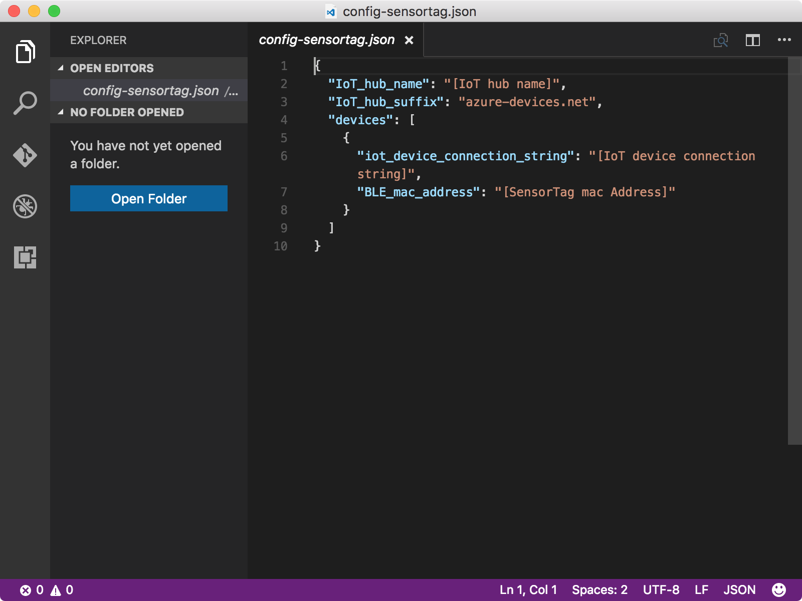
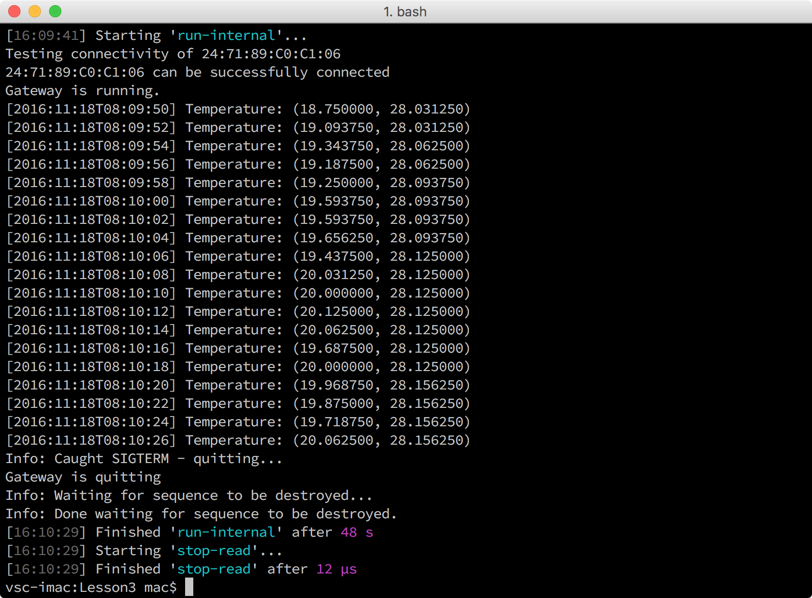

# 配置和运行 BLE 示例应用程序

## 执行的操作

- 克隆示例存储库。
- 设置 SensorTag 与 Intel NUC 之间的连接。
- 使用 Azure CLI 获取 BLE（低能耗蓝牙，Bluetooth Low Energy）示例应用程序的 IoT 中心和 SensorTag 信息。配置和运行 BLE 示例应用程序。

如果有问题，可在[故障排除页](./iot-hub-gateway-kit-c-troubleshooting.md)上查找解决方案。

## 你要学习的知识

本文介绍：

- 如何配置和运行 BLE 示例应用程序。

## 需要什么

必须已成功完成

- [创建 IoT 中心和注册 SensorTag](./iot-hub-gateway-kit-c-lesson2-register-device.md)

## 将示例存储库克隆到主计算机

若要克隆示例存储库，请在主计算机上执行以下步骤：

1. 在 Windows 中打开命令提示符窗口，或在 macOS 或 Ubuntu 中打开终端。
2. 运行以下命令：

    ```bash
       git clone https://github.com/Azure-samples/iot-hub-c-intel-nuc-gateway-getting-started
       cd iot-hub-c-intel-nuc-gateway-getting-started
    ```

## 设置 SensorTag 与 Intel NUC 之间的连接

若要设置连接，请在主计算机上执行以下步骤：

1. 运行以下命令初始化配置文件：

    ```bash
       cd Lesson3
       npm install
       gulp init
    ```

2. 运行以下命令，在 Visual Studio Code 中打开 `config-gateway.json`：

    ```bash
       # For Windows command prompt
       code %USERPROFILE%\.iot-hub-getting-started\config-gateway.json
       # For macOS or Ubuntu
       code ~/.iot-hub-getting-started/config-gateway.json
    ```

3. 找到以下代码行，将 `[device hostname or IP address]` 替换为 Intel NUC 的 IP 地址或主机名。


4. 运行以下命令，在 Intel NUC 上安装帮助程序工具：

    ```bash
    gulp install-tools
    ```

5. 按电源按钮（如下图所示）打开 SensorTag，绿色 LED 应闪烁。

    

6. 运行以下命令，扫描 SensorTag 设备：

    ```bash
    gulp discover-sensortag
    ```

7. 运行以下命令，测试 SensorTag 与 Intel NUC 之间的连接：

    ```bash
    gulp test-connectivity --mac {mac address}
    ```

    将 `{mac address}` 替换为在前面步骤中获取的 MAC 地址。

## 获取 SensorTag 的连接字符串

若要获取 SensorTag 的 Azure IoT 中心连接字符串，请在主计算机上运行以下命令：

```bash
az iot device show-connection-string --hub-name {IoT hub name} --device-id mydevice --resource-group iot-gateway
```

`{IoT hub name}` 是所使用的 IoT 中心名称。使用 iot-gateway 作为 `{resource group name}` 的值，使用 mydevice 作为 `{device id}` 的值（如果尚未更改第 2 课中的值）。

## 配置 BLE 示例应用程序

若要配置和运行 BLE 示例应用程序，请在主计算机上执行以下步骤：

1. 运行以下命令，在 Visual Studio Code 中打开 `config-sensortag.json`：

    ```bash
       # For Windows command prompt
       code %USERPROFILE%\.iot-hub-getting-started\config-sensortag.json
       # For macOS or Ubuntu
       code ~/.iot-hub-getting-started/config-sensortag.json
    ```

      

2. 在代码中进行以下替换：
   - 将 `[IoT hub name]` 替换为所使用的 IoT 中心名称。
   - 将 `[IoT device connection string]` 替换为获取的 SensorTag 的连接字符串。
   - 将 `[device_mac_address]` 替换为获取的 SensorTag 的 MAC 地址。

3. 运行 BLE 示例应用程序。

    若要运行 BLE 示例应用程序，请在主计算机上执行以下步骤：

    1. 打开 SensorTag。

    2. 运行以下命令，在 Intel NUC 上部署和运行 BLE 示例应用程序：

        ```bash
        gulp run
        ```

## 确认 BLE 示例应用程序可以正常运行

现在应看到如下所示的输出：

  

示例应用程序持续收集温度数据，并将其发送到 IoT 中心。示例应用程序在执行发送操作 40 秒后会自动终止。

## 摘要

已成功设置 SensorTag 与 Intel NUC 之间的连接，以及运行从 SensorTag 收集数据并将数据发送到 IoT 中心的 BLE 示例应用程序。已准备好学习如何确认 IoT 中心已收到数据。

## 后续步骤
[从 IoT 中心读取消息](./iot-hub-gateway-kit-c-lesson3-read-messages-from-hub.md)

<!---HONumber=Mooncake_0116_2017-->