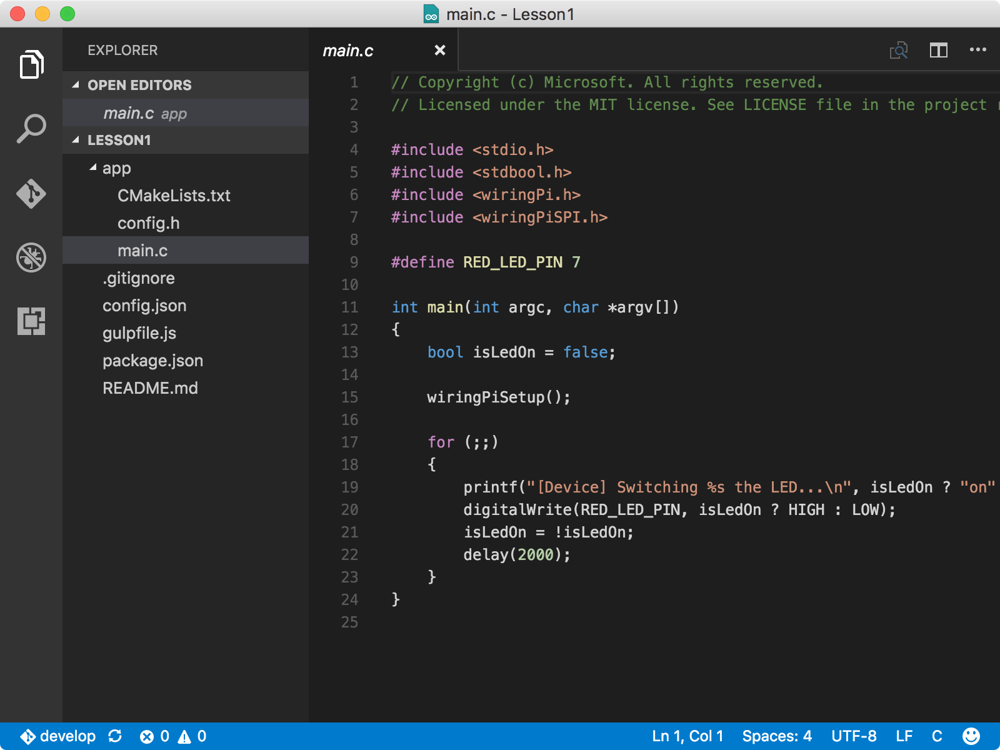

# 创建和部署 blink 应用程序
## 执行的操作
克隆 GitHub 提供的示例 C 应用程序，并使用 gulp 工具将该示例应用程序部署到 Raspberry Pi 3。此示例应用程序每隔两秒让连接到板的 LED 闪烁一次。如果有问题，可在[故障排除页](./iot-hub-raspberry-pi-kit-c-troubleshooting.md)上查找解决方案。

## 你要学习的知识
本文介绍：

* 如何使用 `device-discover-cli` 工具检索有关 Pi 的网络信息。
* 如何在 Pi 上部署和运行示例应用程序。
* 如何部署和调试在 Pi 上远程运行的应用程序。

## 需要什么
必须成功完成以下操作：

* [配置设备](./iot-hub-raspberry-pi-kit-c-lesson1-configure-your-device.md)
* [获取工具](./iot-hub-raspberry-pi-kit-c-lesson1-get-the-tools-win32.md)

## 获取 Pi 的 IP 地址和主机名
在 Windows 或者 macOS 或 Ubuntu 的终端中打开命令提示符，然后运行以下命令：

```bash
devdisco list --eth
```

输出应如下所示：

  

记下 Pi 的 `IP address` 和 `hostname`。本文后面的步骤需要此信息。

> [!NOTE]
确保 Pi 与计算机连接到同一网络。例如，如果计算机连接到无线网络，而 Pi 连接到有线网络，则可能看不到 devdisco 输出中的 IP 地址。

## 打开示例应用程序
若要打开示例应用程序，请执行以下步骤：

1. 通过运行以下命令克隆 GitHub 中的示例存储库：

    ```bash
    git clone https://github.com/Azure-Samples/iot-hub-c-raspberrypi-getting-started.git
    ```

2. 通过运行以下命令在 Visual Studio Code 中打开示例应用程序：

    ```bash
        cd iot-hub-c-raspberrypi-getting-started
        cd Lesson1
        code .
    ```

  

`app` 子文件夹中的 `main.c` 文件是重要的源文件，其中包含用于控制 LED 的代码。

### 安装应用程序依赖项
运行以下命令，安装示例应用程序所需的库和其他模块：

```bash
npm install
```

## 配置设备连接
若要配置设备连接，请执行以下步骤：

1. 运行以下命令，生成设备配置文件：

    ```bash
    gulp init
    ```

    配置文件 `config-raspberrypi.json` 包含用来登录到 Pi 的用户凭据。为了避免用户凭据泄漏，配置文件在计算机主文件夹的 `.iot-hub-getting-started` 子文件夹中生成。

2. 运行以下命令，在 Visual Studio Code 中打开设备配置文件：

    ```bash
       # For Windows command prompt
       code %USERPROFILE%\.iot-hub-getting-started\config-raspberrypi.json

       # For MacOS or Ubuntu
       code ~/.iot-hub-getting-started/config-raspberrypi.json
    ```

3. 将占位符 `[device hostname or IP address]` 替换为此前在“获取 Pi 的 IP 地址和主机名”中获得的 IP 地址或主机名。

      

> [!NOTE]
>连接到 Raspberry Pi 时，可以使用 SSH 密钥而不是用户名和密码。为此，必须使用 **ssh-keygen** 和 **ssh-copy-id pi@<device address>** 生成该密钥。
>
> 在 Windows 中，这些命令均位于 **Git Bash**。
>
> 在 MacOS 中，需要运行 **brew install ssh-copy-id**。
>
> 成功将密钥上传到 Raspberry Pi 后，请将 **device\_password** 替换为 **config-raspberrypi.json** 中的 **device\_key\_path** 属性。
>
> 更新后的行应如下所示：
> ` "device_user_name": "pi",  "device_key_path": "id_rsa"`

祝贺你！ 你已成功创建 Pi 的第一个示例应用程序。

## 部署并运行示例应用程序
### 在 Pi 上安装 Azure IoT 中心 SDK
通过运行以下命令来安装 Azure IoT 中心 SDK：

```bash
gulp install-tools
```

此任务在首次运行时可能需要几分钟才能完成。

### 部署并运行示例应用
运行以下命令，部署并运行示例应用程序：

```bash
gulp deploy && gulp run
```

### 确保应用正常运行
LED 闪烁 20 次后，示例应用程序会自动终止。如果看不到 LED 闪烁，请参阅[故障排除指南](./iot-hub-raspberry-pi-kit-c-troubleshooting.md)，了解常见问题的解决方案。

## 摘要
用户已安装适用于 Pi 的必需工具，并已将使 LED 闪烁的示例应用程序部署到 Pi。用户现在可以创建、部署和运行其他示例应用程序，以便将 Pi 连接到发送和接收消息的 Azure IoT 中心。

## 后续步骤
[获取 Azure 工具](./iot-hub-raspberry-pi-kit-c-lesson2-get-azure-tools-win32.md)

<!---HONumber=Mooncake_0103_2017-->