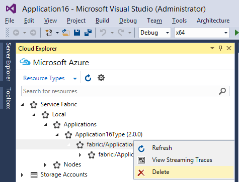

# 使用 Visual Studio 简化 Service Fabric 应用程序的编写和管理

你可以通过 Visual Studio 管理 Azure Service Fabric 应用程序和服务。[设置开发环境](./service-fabric-get-started.md)之后，你可以使用 Visual Studio 创建 Service Fabric 应用程序、添加服务，或在本地开发群集中打包、注册和部署应用程序。

## 部署 Service Fabric 应用程序

默认情况下，部署一个应用程序会将以下步骤合并为一个简单的操作：

1. 创建应用程序包
2. 将应用程序包上载到映像存储
3. 注册应用程序类型
4. 删除任何正在运行的应用程序实例
5. 创建新的应用程序实例

在 Visual Studio 中按 **F5** 还可以部署应用程序，并将调试器附加到所有应用程序实例。你可以使用 **Ctrl + F5** 部署应用程序而不进行调试，或者使用发布配置文件将应用程序发布到本地或远程群集。有关详细信息，请参阅[使用 Visual Studio 将应用程序发布到远程群集](./service-fabric-publish-app-remote-cluster.md)。

### 应用程序调试模式

默认情况下，停止调试或（如果你在部署应用时未附加调试器）重新部署应用程序时，Visual Studio 会删除应用程序类型的现有实例。在这种情况下，该应用程序的所有数据将被删除。在本地调试时，可能需要保留在测试新版本的应用程序时已经创建的数据、想要让应用程序继续运行，或想要后续的调试会话升级应用程序。Visual Studio Service Fabric 工具提供一个名为**应用程序调试模式**的属性，该属性控制在调试会话结束之后，**F5** 操作是卸载应用程序、保持应用程序运行，还是让应用程序在后续调试会话中升级，而不删除或重新部署。

#### 设置“应用程序调试模式”属性

1. 在应用程序项目的快捷菜单上，选择“属性”（或按 **F4** 键）。
2. 在“属性”窗口中设置“应用程序调试模式”属性。

    ![设置“应用程序调试模式”属性][debugmodeproperty]  

下面是可用的“应用程序调试模式”选项。

1. **自动升级**：调试会话结束时，应用程序继续运行。再次使用 **F5** 时，该操作会将该部署视为一次升级，使用无监控的自动模式将此应用程序快速升级到附加了日期字符串的较新的版本。此升级过程会保留你在上一个调试会话中输入的任何数据。

2. **保留应用程序**：调试会话结束时，应用程序在群集中保持运行。下次按 **F5** 会删除该应用程序，然后将新构建的应用程序部署到群集。

3. **删除应用程序**：调试会话结束时删除应用程序。

**自动升级**：通过应用 Service Fabric 的应用程序升级功能保存数据，但会出于性能优化而非安全性的目的将数据进行优化。有关升级应用程序和在真实环境中如何执行升级的详细信息，请参阅 [Service Fabric 应用程序升级](./service-fabric-application-upgrade.md)。

![附加了日期的新应用程序版本的示例][preservedata]  

>[!NOTE] 1.1 版之前的适用于 Visual Studio 的 Service Fabric 工具版本不具有此属性。对于 1.1 版之前的版本，请使用“启动时保留数据”属性实现相同的效果。“保留应用程序”选项是在用于 Visual Studio 的 Service Fabric 工具 1.2 版本中引入的。

## 向 Service Fabric 应用程序添加服务

可以向你的应用程序中添加新的服务来扩展其功能。若要确保应用程序包中包含该服务，请通过“新建 Fabric 服务...”菜单项添加服务。

![将新的 Fabric 服务添加到你的应用程序中][newservice]  

选择要添加到你的应用程序的 Service Fabric 项目类型，并指定服务的名称。请参阅[为服务选择框架](./service-fabric-choose-framework.md)，帮助确定要使用的服务类型。

![选择要添加到你的应用程序的 Fabric 服务项目类型][addserviceproject]  

新的服务会添加到你的解决方案和现有应用程序包中。服务引用和默认的服务实例会添加到应用程序清单中。将在下次部署应用程序时创建并启动服务。

![新的服务会添加到应用程序清单中][newserviceapplicationmanifest]  

## 打包 Service Fabric 应用程序

要将应用程序及其服务部署到群集中，你需要创建应用程序包。该包会组织应用程序清单、服务清单和特定布局的其他必要文件。Visual Studio 设置和管理“pkg”目录中应用程序项目的文件夹中的包。从“应用程序”上下文菜单中单击“包”创建或更新应用程序包。如果使用自定义 Powershell 脚本部署应用程序，你可能要执行此操作。

## 使用云资源管理器删除应用程序和应用程序类型

可以使用云资源管理器从 Visual Studio 内部执行基本的群集管理操作，可以从“视图”菜单启动该管理器。例如，可以删除本地或远程群集上的应用程序和取消设置其上的应用程序类型。

  

>[!TIP] 有关更丰富的群集管理功能，请参阅[使用 Service Fabric Explorer 可视化群集](./service-fabric-visualizing-your-cluster.md)。

<!--Every topic should have next steps and links to the next logical set of content to keep the customer engaged-->

## 后续步骤

- [Service Fabric 应用程序模型](./service-fabric-application-model.md)
- [Service Fabric 应用程序部署](./service-fabric-deploy-remove-applications.md)
- [管理多个环境的应用程序参数](./service-fabric-manage-multiple-environment-app-configuration.md)
- [调试 Service Fabric 应用程序](./service-fabric-debugging-your-application.md)
- [使用 Service Fabric 资源管理器可视化群集](./service-fabric-visualizing-your-cluster.md)

<!--Image references-->

[addserviceproject]: ./media/service-fabric-manage-application-in-visual-studio/addserviceproject.png
[manageservicefabric]: ./media/service-fabric-manage-application-in-visual-studio/manageservicefabric.png
[newservice]: ./media/service-fabric-manage-application-in-visual-studio/newservice.png
[newserviceapplicationmanifest]: ./media/service-fabric-manage-application-in-visual-studio/newserviceapplicationmanifest.png
[preservedata]: ./media/service-fabric-manage-application-in-visual-studio/preservedata.png
[debugmodeproperty]: ./media/service-fabric-manage-application-in-visual-studio/debugmodeproperty.png

<!---HONumber=Mooncake_Quality_Review_0117_2017-->